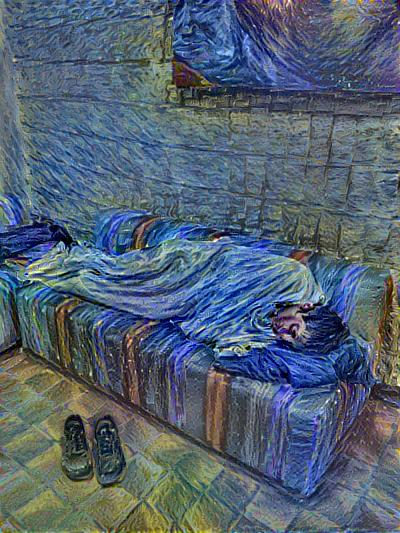

# Neural Style Transfer

An implementation of [neural style][paper] in TensorFlow.

Also includes a flask app to load images and run the program.

## Running

### Using Website

1. Change the root folder in website.py to point to the repository root.
2. Run the flask app - `python website.py`
3. Open the webpage in a web-browser and follow on-screen instructions.

Use `--iterations` in `website.py` to change the number of iterations (default 1000).

### Using CLI

`python neural_style.py --content <content file> --styles <style file> --output <output file>`

Use `--iterations` to change the number of iterations (default 1000).

## Example 1

The following example was run for 1000 iterations to produce the result (with
default parameters):

These were the input images used:

## Requirements

### Data Files

* [Pre-trained VGG network][net] (MD5 `106118b7cf60435e6d8e04f6a6dc3657`) - download and put it in the top level of this repository.

### Dependencies

You can install Python dependencies using `pip install -r requirements.txt`,
and it should just work. If you want to install the packages manually, here's a
list:

* [TensorFlow](https://www.tensorflow.org/versions/master/get_started/os_setup.html#download-and-setup)
* [NumPy](https://github.com/numpy/numpy/blob/master/INSTALL.rst.txt)
* [SciPy](https://github.com/scipy/scipy/blob/master/INSTALL.rst.txt)
* [Pillow](http://pillow.readthedocs.io/en/3.3.x/installation.html#installation)
* [Flask](https://flask.palletsprojects.com/en/1.1.x/installation/)

[net]: http://www.vlfeat.org/matconvnet/models/imagenet-vgg-verydeep-19.mat
[paper]: http://arxiv.org/pdf/1508.06576v2.pdf
